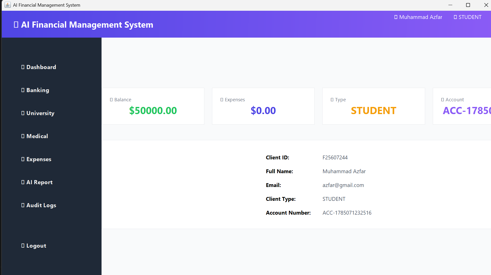
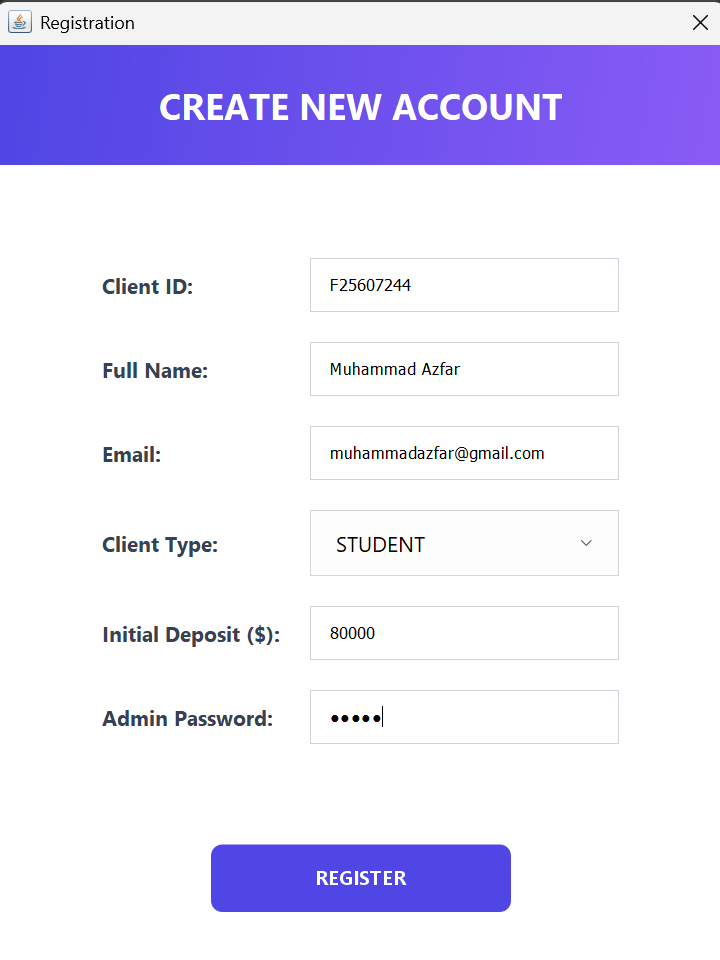
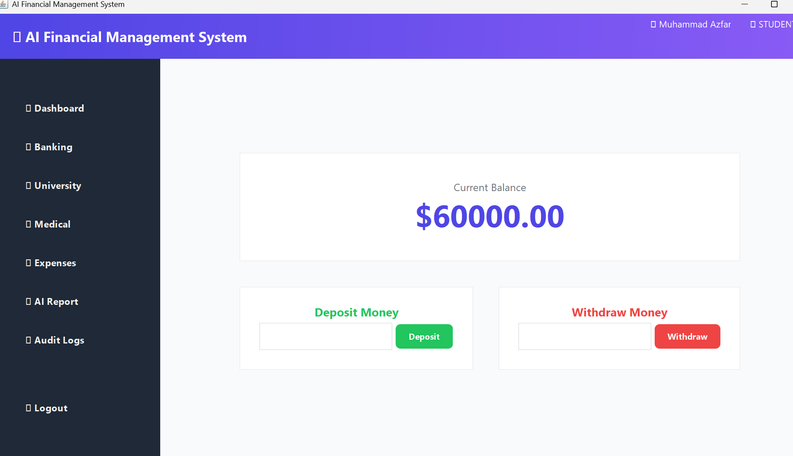
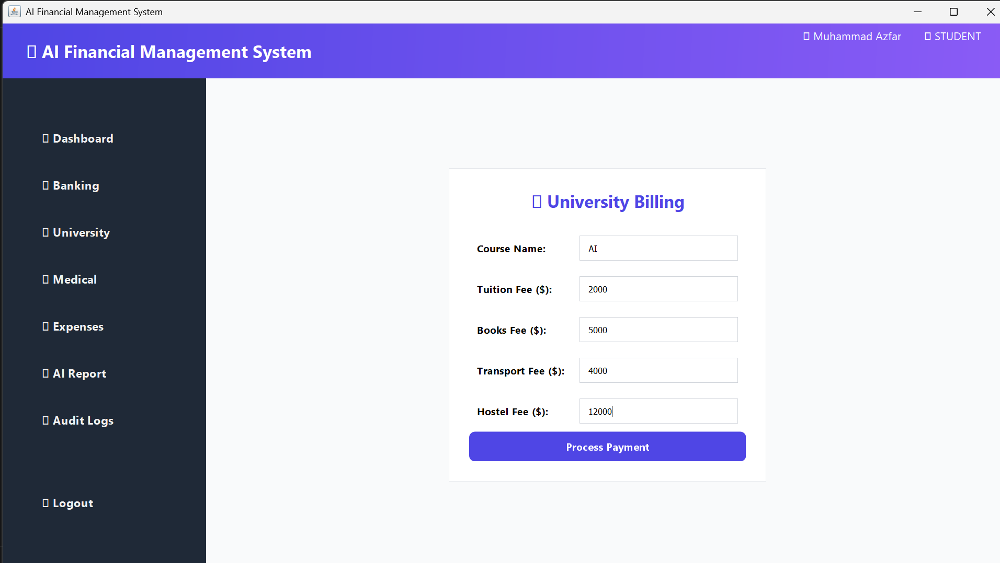
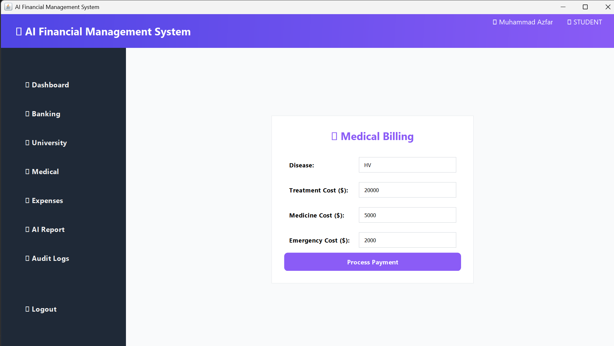
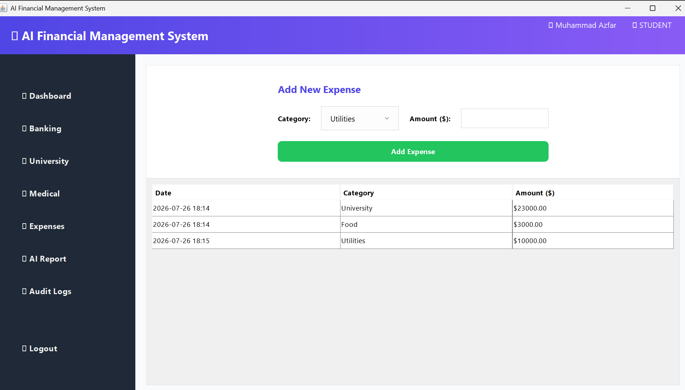
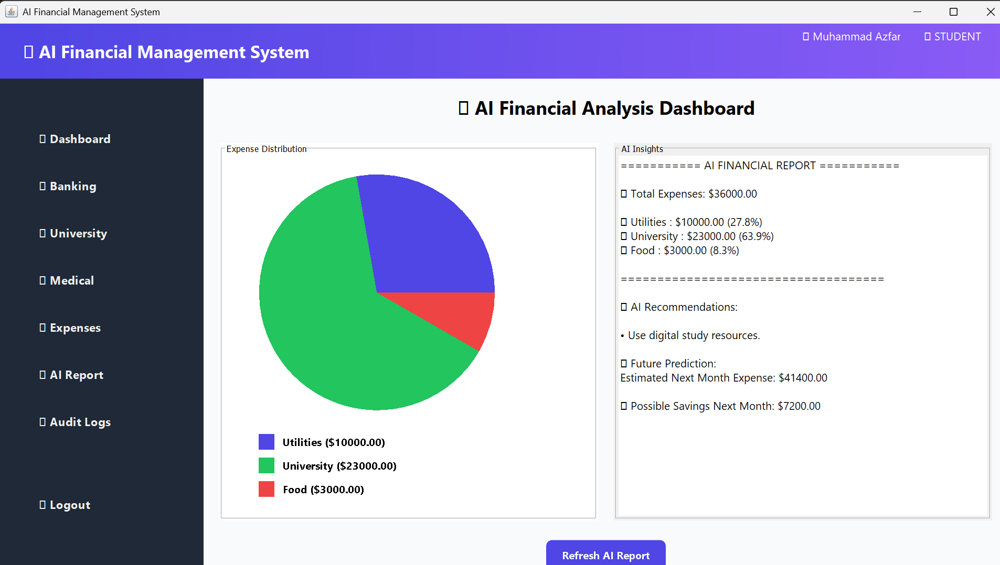
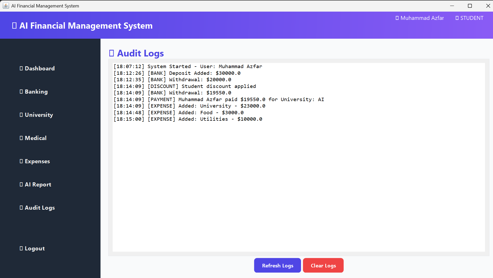

<p align="center">
  
</p>

# 💰 AI Financial Management System

<p align="center">
  <strong>An AI-powered Java desktop application for managing Banking, University, Healthcare, and Personal Finance with intelligent expense analysis and reporting.</strong>
</p>

<p align="center">


</p>

---

# 📖 Project Overview

The **AI Financial Management System** is a Java-based desktop application that combines multiple real-world financial domains into one platform.

It provides dedicated modules for:

- 🏦 Banking
- 🎓 University Finance
- 🏥 Medical Finance
- 💰 Expense Management
- 🤖 AI Financial Report Generation
- 📋 Audit Logging

The project demonstrates Object-Oriented Programming (OOP), GUI development using Java Swing, secure transaction handling, and AI-inspired financial analysis.

---

# ✨ Features

## 🔐 Secure Login
- User Authentication
- Secure Access to System

## 📊 Dashboard
- Centralized Navigation
- Quick Access to Every Module

## 🏦 Banking Module
- Create Bank Accounts
- Savings Account Support
- Deposit & Withdraw
- Secure Transactions

## 🎓 University Module
- Student Financial Records
- Course Management
- Fee Information

## 🏥 Medical Module
- Patient Records
- Medical Expenses
- Healthcare Financial Management

## 💰 Expense Management
- Record Daily Expenses
- Expense Categorization
- Financial Tracking

## 🤖 AI Report
- Intelligent Expense Analysis
- Financial Insights
- Report Generation

## 📋 Audit Logs
- Activity Monitoring
- User Actions
- Transaction Logs

---

# 🛠 Technologies Used

- Java
- Java Swing
- Object-Oriented Programming (OOP)
- File Handling
- Data Structures
- Custom Chart Components
- AI-Based Financial Analysis

---

# 📂 Project Structure

```
AI-Financial-Management-System
│
├── Main.java
├── MainUI.java
├── app.java
├── EnterpriseNetwork.java
├── HealthcareFinanceGUI.java
├── aiReport.java
├── ChartFactory.java
├── ChartPanel.java
├── DefaultPieDataset.java
├── JFreeChart.java
├── screenshots/
└── README.md
```

---

# 📸 Application Screenshots

## 🔐 Login Page



---

## 📊 Dashboard


---

## 🏦 Banking Module



---

## 🎓 University Module



---

## 🏥 Medical Module



---

## 💰 Expense Management



---

## 🤖 AI Report



---

## 📋 Audit Logs



---

# 🚀 Installation

### Clone Repository

```bash
git clone https://github.com/muhammadazfar-ai/AI-Financial-Management-System.git
```

### Open Project

Open the project using:

- VS Code
- IntelliJ IDEA
- Eclipse
- NetBeans

### Compile

```bash
javac *.java
```

### Run

```bash
java Main
```

---

# 🎯 Core Concepts Implemented

- Object-Oriented Programming
- Encapsulation
- Inheritance
- Polymorphism
- Abstraction
- Interfaces
- GUI Development
- Financial Management
- AI-Based Expense Analysis

---

# 🚀 Future Improvements

- Database Integration (MySQL)
- User Authentication with Roles
- Cloud Storage
- PDF Report Generation
- Email Notifications
- Machine Learning Expense Prediction
- Interactive Analytics Dashboard

---

# 👨‍💻 Author

**Muhammad Azfar**

BS Artificial Intelligence Student

GitHub:
https://github.com/muhammadazfar-ai

---

# ⭐ Support

If you found this project useful, consider giving it a **⭐ Star** on GitHub.

It helps support the project and motivates future improvements.

---

## 📜 License

This project is licensed under the **MIT License**.
